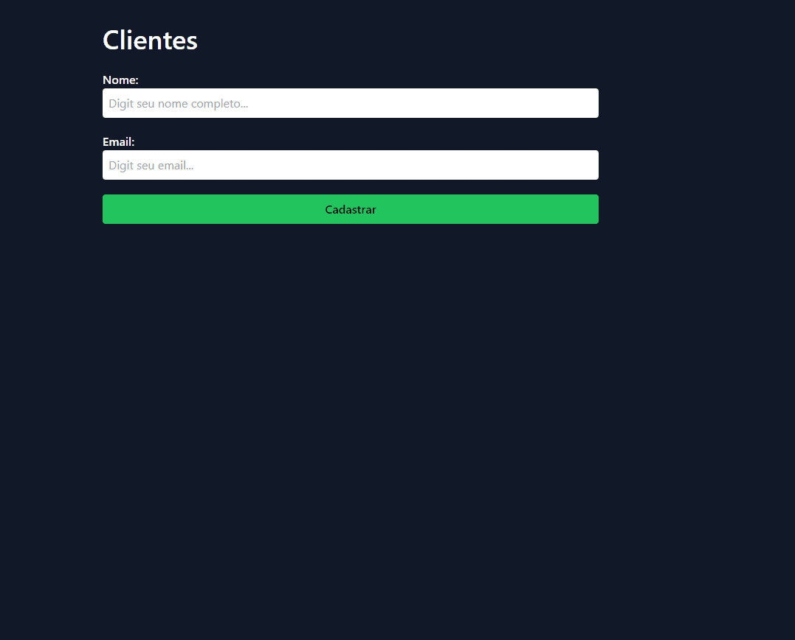

# Cadastro de Usuário

Este é um projeto full-stack para cadastro de usuário. O backend foi desenvolvido em Node.js com Fastify, Prisma, TypeScript e MongoDB, enquanto o frontend foi desenvolvido em React com TypeScript.

## Funcionalidades

- Cadastro de usuário com nome e email
- Exibição dos usuários cadastrados
- Exclusão de usuário

[]

## Tecnologias Utilizadas

- **Backend:**
  - Node.js
  - Fastify
  - Prisma
  - TypeScript
  - MongoDB

- **Frontend:**
  - React
  - TypeScript

## Instalação

1. Clone o repositório: `git clone https://github.com/seu-usuario/seu-projeto.git`
2. Instale as dependências do backend: `cd backend && npm install`
3. Instale as dependências do frontend: `cd frontend && npm install`

# Uso

1. Inicie o servidor backend: `cd backend && npm run dev`
2. Inicie o servidor frontend: `cd frontend && npm run dev`

## Descrição Detalhada

Este projeto consiste em uma aplicação full-stack para cadastro de usuários. No frontend, o usuário pode inserir seu nome e email em um formulário e clicar no botão "Cadastrar". Após o cadastro, o usuário é exibido na tela juntamente com um toast indicando que foi cadastrado com sucesso.

Além disso, cada usuário cadastrado é exibido em uma lista com a opção de excluí-lo clicando em um botão de lixeira ao lado do seu nome.